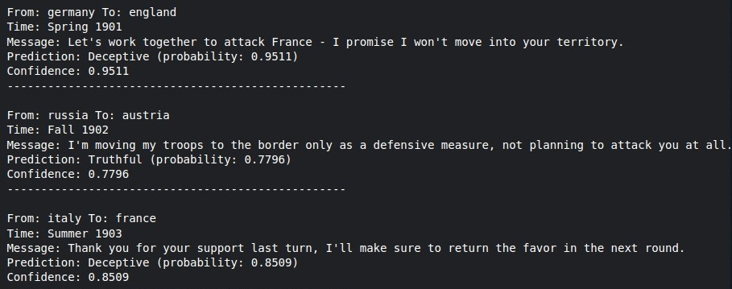

# Deception-Detection
## Aditya Sahai (MT24009) ; Sharad Jain (MT24138) ; Shreyas Rajendra Gore (MT24087)
## Overview
The QANTA Diplomacy project focuses on detecting deceptive messages between players in the strategy game Diplomacy. The task involves analyzing text and metadata to classify messages as either deceptive or truthful. This has implications for NLP, decision-making tasks, game theory, and security applications.

## Dataset
- 17,289 in-game messages from the Diplomacy game
- Each message annotated by sender (truthful/deceptive) and receiver (perceived deception)
- Significant class imbalance: deceptive messages constitute only ~5% of examples
- Includes message-level, speaker-level, and conversation-level metadata
- Metadata includes: message text, countries involved, game scores, message indices, and temporal context

## Methodology
The project compared four modeling approaches of increasing complexity:

1. **BiLSTM+Attention**: Simple baseline using BiLSTM with attention mechanism and structured metadata
2. **BiLSTM+Power+RoBERTa**: Combined BiLSTM with frozen RoBERTa embeddings and metadata features
3. **LLM2Vec+GNN**: Message and player interactions modeled as a heterogeneous graph with DistilBERT embeddings
4. **MLDM (Multi-Level Deception Model)**: Best-performing model combining DistilBERT embeddings with dialogue act predictions, power difference embeddings, and graph encoding

## Key Techniques
- **Data Augmentation**: Synonym replacement on deceptive messages
- **Balanced Sampling**: Oversampling of deceptive class to handle imbalance
- **Metadata Integration**: Incorporating structured game data with text representations
- **Graph Construction**: Building heterogeneous graphs representing message-message and player-message relationships

## Results
| Model | MacroF1 | Accuracy |
|-------|---------|----------|
| BiLSTM+Attention | 0.47 | 0.67 |
| BiLSTM+RoBERTa | 0.49 | 0.68 |  
| LLM2Vec+GNN | 0.53 | 0.81 |
| MLDM | 0.54 | 0.83 |

## Inference Steps
To run inference with the MLDM model:

1. **Required Files**:
   - `deception/train.jsonl` - Training dataset
   - `deception/validation.jsonl` - Validation dataset
   - `deception/test.jsonl` - Test dataset
   - `best_model_checkpoint.pt` - Pretrained model
   - `u_cache.pt` - Precomputed DistilBERT embeddings cache

2. **Setup Environment**:
   ```bash
   pip install torch torch-geometric transformers nlpaug scikit-learn pandas numpy matplotlib seaborn tqdm
   ```

3. **Run Inference**:
   inference.ipynb


4. **Inference Pipeline**:
   - The script loads the test data from JSONL files
   - Generates DistilBERT embeddings for each message
   - Constructs a graph representing message-speaker relationships
   - Loads the pretrained MLDM model weights
   - Runs inference with a threshold of 0.60 for deception detection
   - Outputs accuracy, Macro F1, and Deceptive F1 scores
   - Saves predictions to `test_predictions.csv`
     
5. **Inference Results on Custom Examples**:
   
   


## Conclusion
The best performance was achieved by the MLDM model which fuses linguistic, structural, and strategic context. Graph-based architectures outperformed sequential baselines by modeling message relationships and player interactions. The project demonstrates the importance of combining pretrained language models with relational graph modeling and metadata fusion for effective deception detection in strategic environments.

## Future Work
- Dynamic graph modeling using temporal graph neural networks
- Expanded metadata usage including action orders and alliance formations
- Broader applications in dialog-based trust modeling and adversarial communication

## Team
- Aditya Sahai (MT24009)
- Shreyas Rajendra Gore (MT24087)
- Sharad Jain (MT24132)
